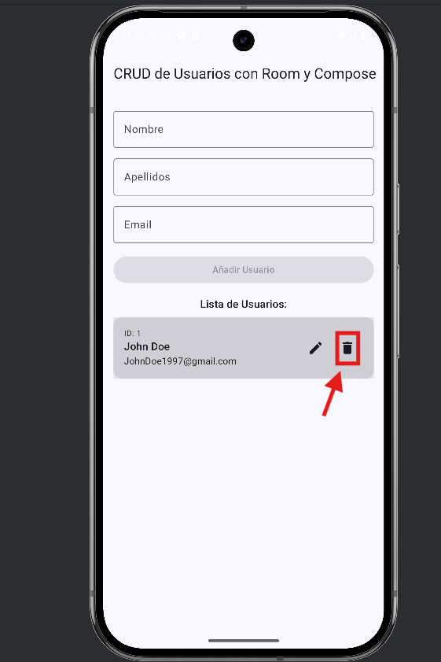

# RoomBasics - CRUD con Room y Jetpack Compose

Este proyecto es una aplicación Android básica de la implementación de operaciones CRUD (Crear, Leer, Actualizar, Borrar) utilizando la base de datos Room y la interfaz de usuario declarativa de Jetpack Compose. Es una solución sencilla para gestionar una lista de usuarios, mostrando cómo integrar estas dos potentes herramientas en una aplicación moderna.

## Características

* **Creación de Usuarios:** Añade nuevos usuarios a la base de datos.
* **Lectura de Usuarios:** Muestra una lista de todos los usuarios almacenados.
* **Actualización de Usuarios:** Permite modificar la información de usuarios existentes.
* **Eliminación de Usuarios:** Borra usuarios de la base de datos.
* **Interfaz de Usuario:** Desarrollada completamente con Jetpack Compose para una experiencia de usuario fluida y reactiva.
* **Persistencia de Datos:** Utiliza Room como capa de abstracción para SQLite, proporcionando una forma robusta de manejar datos locales.

## Tecnologías Utilizadas

* **Kotlin:** Lenguaje de programación principal.
* **Jetpack Compose:** Kit de herramientas moderno para construir la UI nativa de Android.
* **Room Persistence Library:** Capa de abstracción de base de datos para SQLite.
* **MVVM (Model-View-ViewModel):** Arquitectura recomendada para el desarrollo de Android.

## Screenshots

A continuación, se muestran las pantallas clave de la aplicación en acción:

### Pantalla Principal (FirstScreen)
La pantalla inicial que muestra la lista de usuarios y las opciones principales.

`
### Añadir Nuevo Usuario (AddUser)
Formulario para ingresar la información de un nuevo usuario.

`
### Editar Usuario (EditUser)
Pantalla para modificar los detalles de un usuario existente.

`
### Usuario Editado Confirmado (ConfirmedEditedUser)
Confirmación visual de que un usuario ha sido actualizado correctamente.

`
### Eliminar Usuario (RemoveUser)
Diálogo o pantalla para confirmar la eliminación de un usuario.

`
### Usuario Eliminado Confirmado (ConfirmedRemovedUser)
Confirmación visual de que un usuario ha sido eliminado exitosamente.

`

## Cómo Ejecutar el Proyecto

1.  **Clonar el Repositorio:**
    ```bash
    git clone [https://github.com/ComputerGorilla/RoomBasics.git](https://github.com/ComputerGorilla/RoomBasics.git)
    ```
2.  **Abrir en Android Studio:**
    Abre el proyecto clonado con Android Studio.
3.  **Sincronizar Gradle:**
    Deja que Gradle sincronice las dependencias.
4.  **Ejecutar la Aplicación:**
    Ejecuta la aplicación en un emulador o un dispositivo Android.
